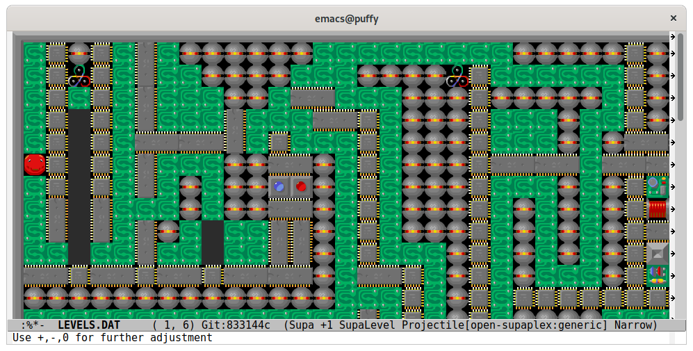

# Supaplex @ Emacs

## Installation

TBD

For now, checkout the code to `~/src/supa-el` or edit the tiles location in
the source, if running from a different directory.

Evaluate the whole file [`supa.el`](supa.el).

## Usage

1. Open your `LEVELS.DAT`.
2. `M-x supa-mode`.

Or add it to your `.emacs`: `(add-to-list 'auto-mode-alist '("LEVELS\.DAT" . supa-mode))`

### Screenshots

Level editing in action:

If the tiles are too small for your screen, use the text scaling commands
(`C-x C-=`, `C-x C--`, etc.) to increase the tile size (up to 4x):

## License

GNU GPL v3.

Original tiles image taken from:
https://github.com/mokyu/supaplex-level-editor/blob/master/resources/tiles.png

Tiles upscaled using: https://www.maxlaumeister.com/pixel-art-upscaler/
